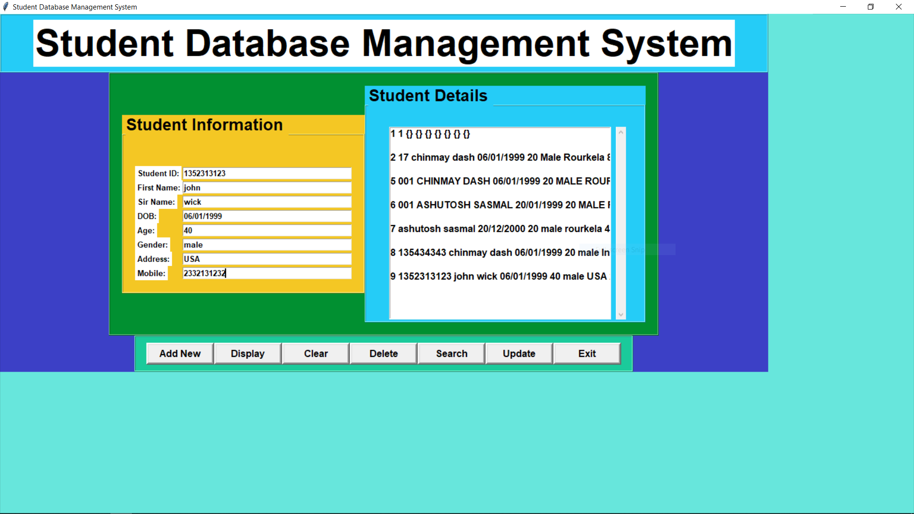

# StudentDBusingPythonAndTKinter
A small project on Student Database Management System using Python and Tkinter Module.

# Project Description
A student database management system project is made by using python and tkinter GUI module where we can add,modify,delete student details.
Sqlite Database is used to store the data of the students and act to backend .
